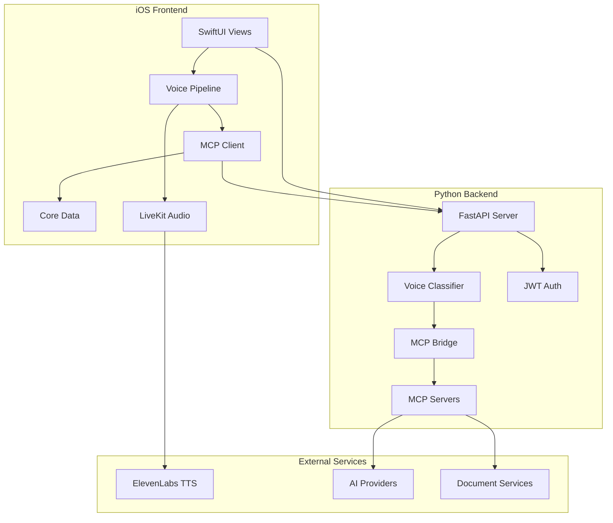
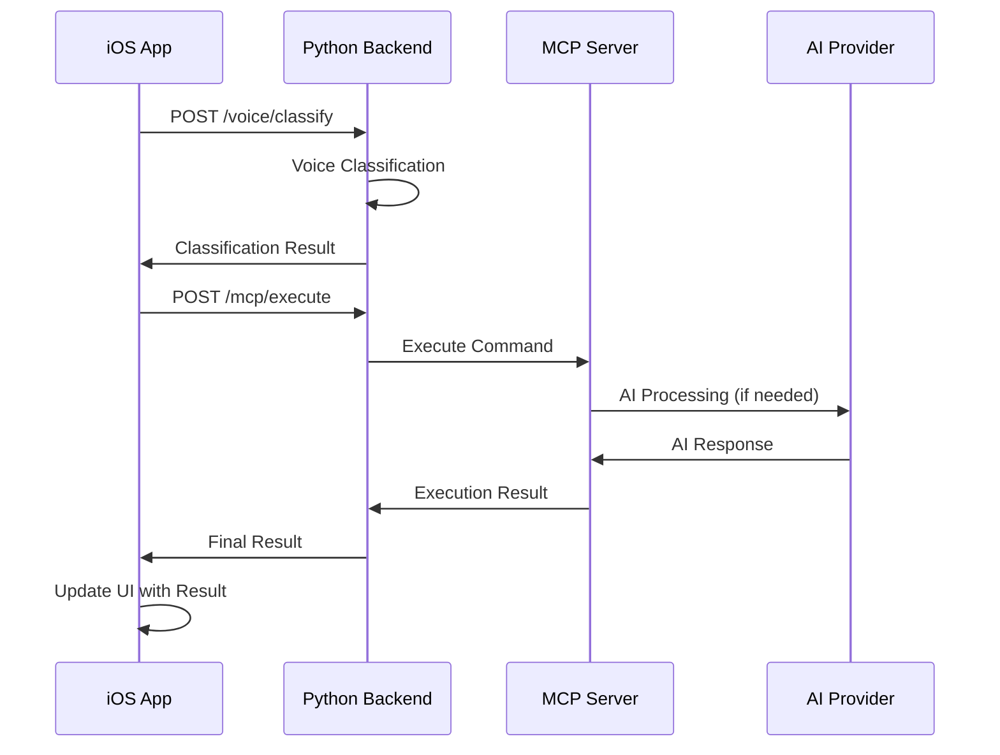
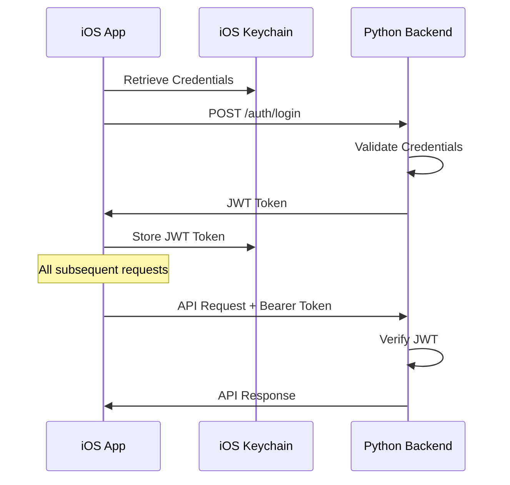

# Jarvis Live Architecture

## Overview

Jarvis Live is a sophisticated iOS Voice AI Assistant with a Python backend, designed for real-time voice interaction, document generation, email management, and productivity automation. The architecture follows modern patterns with emphasis on scalability, maintainability, and real-time performance.

## System Architecture

### High-Level Architecture



### Technology Stack

#### iOS Application
- **UI Framework:** SwiftUI with MVVM pattern
- **Audio Processing:** LiveKit SDK for real-time audio
- **Networking:** URLSession with async/await
- **Storage:** Core Data for conversation history
- **Security:** Keychain Services for credential management
- **Dependency Management:** Swift Package Manager

#### Python Backend
- **Web Framework:** FastAPI with async/await
- **AI Integration:** Multiple providers (Claude, GPT, Gemini)
- **Voice Processing:** Custom classification engine
- **Authentication:** JWT with Bearer tokens
- **MCP Integration:** Meta-Cognitive Primitive servers
- **Database:** PostgreSQL with async drivers

#### External Integrations
- **LiveKit.io:** Real-time audio streaming
- **ElevenLabs:** Voice synthesis
- **Multiple AI Providers:** Claude, OpenAI GPT, Google Gemini
- **MCP Servers:** Document, email, search, calendar services

## Component Architecture

### iOS Application Structure

#### 1. Application Layer (`Sources/App/`)
```swift
// Application lifecycle and configuration
@main
struct JarvisLiveApp: App {
    @StateObject private var authManager = AuthenticationStateManager()
    
    var body: some Scene {
        WindowGroup {
            ContentView()
                .environmentObject(authManager)
        }
    }
}
```

#### 2. Core Services (`Sources/Core/`)

**Voice Pipeline:**
```swift
class VoiceCommandPipeline {
    private let classificationManager: VoiceClassificationManager
    private let mcpServerManager: MCPServerManager
    private let audioManager: LiveKitManager
    
    func processVoiceCommand(_ text: String) async throws -> VoiceCommandPipelineResult {
        // 1. Classify voice command
        let classification = try await classificationManager.classifyVoiceCommand(text)
        
        // 2. Execute via MCP server
        let result = try await mcpServerManager.executeCommand(classification)
        
        // 3. Return structured result
        return VoiceCommandPipelineResult.success(result: result)
    }
}
```

**MCP Client:**
```swift
class MCPServerManager: ObservableObject {
    private var mcpClient: MCPClient
    private let configuration: MCPConfiguration
    
    func executeCommand(_ classification: ClassificationResult) async throws -> MCPExecutionResult {
        switch classification.category {
        case "document_generation":
            return try await handleDocumentGeneration(classification)
        case "email_management":
            return try await handleEmailManagement(classification)
        // ... other categories
        }
    }
}
```

**Authentication:**
```swift
class AuthenticationStateManager: ObservableObject {
    @Published var isAuthenticated = false
    private let keychainManager: KeychainManager
    
    func authenticate() async throws {
        let credentials = try keychainManager.retrieveCredentials()
        let token = try await apiClient.authenticate(credentials)
        try keychainManager.store(token: token)
        await MainActor.run { isAuthenticated = true }
    }
}
```

#### 3. UI Layer (`Sources/UI/`)

**Glassmorphism Theme System:**
```swift
struct GlassViewModifier: ViewModifier {
    func body(content: Content) -> some View {
        content
            .background(.ultraThinMaterial, in: RoundedRectangle(cornerRadius: 16))
            .overlay(
                RoundedRectangle(cornerRadius: 16)
                    .stroke(.white.opacity(0.2), lineWidth: 1)
            )
    }
}
```

**Main Content View:**
```swift
struct ContentView: View {
    @StateObject private var voicePipeline = VoiceCommandPipeline()
    @State private var isListening = false
    
    var body: some View {
        VStack {
            // Voice input interface
            VoiceInputView(isListening: $isListening)
            
            // Results display
            if let result = voicePipeline.lastResult {
                ResultDisplayView(result: result)
            }
        }
        .modifier(GlassViewModifier())
    }
}
```

### Python Backend Structure

#### 1. API Layer (`src/api/`)

**FastAPI Application:**
```python
from fastapi import FastAPI, Depends, HTTPException
from .auth.jwt_auth import verify_token

app = FastAPI(title="Jarvis Live API", version="1.0.0")

@app.post("/voice/classify")
async def classify_voice_command(
    request: VoiceClassificationRequest,
    current_user: dict = Depends(verify_token)
) -> ClassificationResult:
    """Classify voice command into appropriate category."""
    classifier = VoiceClassifier()
    result = await classifier.classify_async(
        text=request.text,
        context=request.context,
        session_id=request.session_id
    )
    return result
```

**Data Models:**
```python
from pydantic import BaseModel
from typing import Optional, Dict, List
from enum import Enum

class CommandCategory(str, Enum):
    DOCUMENT_GENERATION = "document_generation"
    EMAIL_MANAGEMENT = "email_management"
    CALENDAR_SCHEDULING = "calendar_scheduling"
    WEB_SEARCH = "web_search"
    GENERAL_CONVERSATION = "general_conversation"

class ClassificationResult(BaseModel):
    category: CommandCategory
    confidence: float
    parameters: Dict[str, Any]
    suggested_actions: List[str]
    processing_time_ms: float
```

#### 2. AI Layer (`src/ai/`)

**Voice Classification Engine:**
```python
class VoiceClassifier:
    def __init__(self):
        self.model = self._load_classification_model()
        self.confidence_threshold = 0.7
    
    async def classify_async(
        self, 
        text: str, 
        context: Optional[Dict] = None,
        session_id: Optional[str] = None
    ) -> ClassificationResult:
        """Classify voice command with confidence scoring."""
        
        # Preprocess text
        processed_text = self._preprocess(text)
        
        # Extract features
        features = self._extract_features(processed_text, context)
        
        # Classify using multiple methods
        ml_result = await self._ml_classify(features)
        rule_result = self._rule_based_classify(processed_text)
        
        # Combine results
        final_result = self._combine_results(ml_result, rule_result)
        
        return ClassificationResult(
            category=final_result.category,
            confidence=final_result.confidence,
            parameters=final_result.parameters,
            suggested_actions=final_result.actions,
            processing_time_ms=final_result.processing_time
        )
```

#### 3. MCP Integration (`src/mcp/`)

**MCP Bridge:**
```python
class MCPBridge:
    def __init__(self):
        self.servers = {
            "document": DocumentMCPServer(),
            "email": EmailMCPServer(),
            "search": SearchMCPServer(),
            "calendar": CalendarMCPServer()
        }
    
    async def execute_command(
        self, 
        classification: ClassificationResult
    ) -> MCPExecutionResult:
        """Execute command via appropriate MCP server."""
        
        server_name = self._map_category_to_server(classification.category)
        server = self.servers[server_name]
        
        result = await server.execute(
            action=classification.category,
            parameters=classification.parameters
        )
        
        return MCPExecutionResult(
            success=result.success,
            data=result.data,
            execution_time=result.execution_time
        )
```

**Document MCP Server:**
```python
class DocumentMCPServer(MCPServer):
    def __init__(self):
        super().__init__("document-server")
        self.setup_tools()
    
    def setup_tools(self):
        @self.call_tool()
        async def generate_pdf(content: str, title: str = "Document") -> str:
            """Generate PDF document from content."""
            # Implementation for PDF generation
            return await self._generate_pdf(content, title)
        
        @self.call_tool()
        async def generate_docx(content: str, title: str = "Document") -> str:
            """Generate DOCX document from content."""
            # Implementation for DOCX generation
            return await self._generate_docx(content, title)
```

## Data Flow Architecture

### Voice Command Processing Flow



### Authentication Flow



## Security Architecture

### 1. Authentication & Authorization

**JWT Token Structure:**
```json
{
  "user_id": "uuid",
  "api_key_hash": "hashed_value",
  "exp": 1640995200,
  "iat": 1640908800,
  "scopes": ["voice:classify", "mcp:execute"]
}
```

**iOS Keychain Integration:**
```swift
class KeychainManager {
    private let service = "com.jarvis-live.credentials"
    
    func store(token: String) throws {
        let data = token.data(using: .utf8)!
        let query: [String: Any] = [
            kSecClass as String: kSecClassGenericPassword,
            kSecAttrService as String: service,
            kSecValueData as String: data
        ]
        SecItemAdd(query as CFDictionary, nil)
    }
}
```

### 2. Network Security

**Certificate Pinning:**
```swift
class SecureNetworkManager {
    func verifyServerTrust(_ trust: SecTrust, forHost host: String) -> Bool {
        // Implement certificate pinning
        let pinnedCertificates = loadPinnedCertificates()
        return validateCertificateChain(trust, against: pinnedCertificates)
    }
}
```

**API Security Headers:**
```python
from fastapi.middleware.cors import CORSMiddleware
from fastapi.middleware.trustedhost import TrustedHostMiddleware

app.add_middleware(
    TrustedHostMiddleware, 
    allowed_hosts=["jarvis-live.com", "*.jarvis-live.com"]
)

app.add_middleware(
    CORSMiddleware,
    allow_origins=["https://jarvis-live.com"],
    allow_credentials=True,
    allow_methods=["GET", "POST"],
    allow_headers=["Authorization", "Content-Type"]
)
```

## Performance Architecture

### 1. Real-Time Audio Processing

**LiveKit Integration:**
```swift
class LiveKitAudioManager {
    private var room: Room?
    
    func startVoiceSession() async throws {
        let room = Room()
        let connectOptions = ConnectOptions(
            autoSubscribe: true,
            publishOnlyMode: false
        )
        
        try await room.connect(
            url: "wss://agents-playground.livekit.io",
            token: await generateAccessToken(),
            connectOptions: connectOptions
        )
        
        self.room = room
    }
}
```

### 2. Async Processing

**Python Async Architecture:**
```python
import asyncio
from typing import List
import aiohttp

class AsyncVoiceProcessor:
    async def process_batch(
        self, 
        commands: List[str]
    ) -> List[ClassificationResult]:
        """Process multiple commands concurrently."""
        
        tasks = [
            self.classify_async(command) 
            for command in commands
        ]
        
        results = await asyncio.gather(*tasks, return_exceptions=True)
        
        return [
            result for result in results 
            if not isinstance(result, Exception)
        ]
```

### 3. Caching Strategy

**iOS Core Data Caching:**
```swift
class ConversationManager {
    private let persistentContainer: NSPersistentContainer
    
    func cacheConversation(_ conversation: ConversationModel) async {
        let context = persistentContainer.newBackgroundContext()
        await context.perform {
            let entity = ConversationEntity(context: context)
            entity.update(from: conversation)
            try? context.save()
        }
    }
}
```

**Python Redis Caching:**
```python
import redis.asyncio as redis

class ClassificationCache:
    def __init__(self):
        self.redis = redis.Redis(host='localhost', port=6379, db=0)
    
    async def get_cached_result(self, text_hash: str) -> Optional[ClassificationResult]:
        cached = await self.redis.get(f"classification:{text_hash}")
        if cached:
            return ClassificationResult.parse_raw(cached)
        return None
```

## Testing Architecture

### 1. iOS Testing Strategy

**Unit Tests:**
```swift
class VoiceClassificationTests: XCTestCase {
    private var mockClassificationManager: MockVoiceClassificationManager!
    private var pipeline: VoiceCommandPipeline!
    
    override func setUp() async throws {
        mockClassificationManager = MockVoiceClassificationManager()
        pipeline = VoiceCommandPipeline(classificationManager: mockClassificationManager)
    }
    
    func testDocumentGenerationClassification() async throws {
        let result = try await pipeline.processVoiceCommand("Create a PDF about AI")
        XCTAssertEqual(result.classification.category, "document_generation")
        XCTAssertGreaterThan(result.classification.confidence, 0.8)
    }
}
```

**UI Snapshot Tests:**
```swift
class UISnapshotTests: XCTestCase {
    func testMainContentView_iPhone15Pro() {
        let contentView = ContentView()
        let hostingController = UIHostingController(rootView: contentView)
        
        assertSnapshot(
            matching: hostingController,
            as: .image(on: .iPhone15Pro),
            named: "ContentView_iPhone15Pro"
        )
    }
}
```

### 2. Python Testing Strategy

**API Integration Tests:**
```python
import pytest
from fastapi.testclient import TestClient

@pytest.fixture
def authenticated_client():
    client = TestClient(app)
    # Authenticate and return client with token
    return client

def test_voice_classification_endpoint(authenticated_client):
    response = authenticated_client.post("/voice/classify", json={
        "text": "Create a document about AI",
        "session_id": "test-session"
    })
    
    assert response.status_code == 200
    data = response.json()
    assert data["category"] == "document_generation"
    assert data["confidence"] > 0.7
```

**Performance Tests:**
```python
from locust import HttpUser, task, between

class VoiceClassificationUser(HttpUser):
    wait_time = between(0.1, 0.5)
    
    @task(3)
    def classify_document_generation(self):
        self.client.post("/voice/classify", json={
            "text": "Create a PDF document",
            "session_id": f"perf_test_{time.time()}"
        })
```

## Deployment Architecture

### 1. Development Environments

**Sandbox Environment (iOS):**
- Watermarked builds for development
- Complete feature parity with production
- Separate backend environment for testing

**Production Environment:**
- App Store distribution
- Production backend with monitoring
- Real-time analytics and error tracking

### 2. CI/CD Pipeline

**GitHub Actions Workflow:**
```yaml
name: CI/CD Pipeline
on: [push, pull_request]

jobs:
  python-quality-gate:
    runs-on: ubuntu-latest
    steps:
      - name: Run Python tests
        run: python run_minimal_ci_tests.py
  
  ios-quality-gate:
    runs-on: macos-latest
    steps:
      - name: Build and test iOS
        run: |
          xcodebuild build -workspace JarvisLive.xcworkspace -scheme JarvisLive-Sandbox
          xcodebuild test -workspace JarvisLive.xcworkspace -scheme JarvisLive-Sandbox
```

### 3. Monitoring & Analytics

**Performance Monitoring:**
```python
from prometheus_client import Counter, Histogram
import time

classification_requests = Counter('voice_classifications_total', 'Total voice classifications')
classification_duration = Histogram('voice_classification_duration_seconds', 'Classification duration')

async def classify_with_metrics(text: str) -> ClassificationResult:
    start_time = time.time()
    try:
        result = await classifier.classify(text)
        classification_requests.inc()
        return result
    finally:
        classification_duration.observe(time.time() - start_time)
```

**Error Tracking:**
```swift
class ErrorTracker {
    static func logError(_ error: Error, context: [String: Any] = [:]) {
        // Integrate with crash analytics service
        CrashAnalytics.recordError(error, userInfo: context)
    }
}
```

## Future Architecture Considerations

### 1. Scalability Improvements

- **Microservices Migration:** Split monolithic Python backend
- **Edge Computing:** Deploy voice processing closer to users
- **Load Balancing:** Implement proper load distribution
- **Database Sharding:** Scale data storage horizontally

### 2. Advanced Features

- **Multi-Language Support:** Expand voice processing to multiple languages
- **Offline Capabilities:** Local voice processing for iOS
- **Real-Time Collaboration:** Multi-user voice sessions
- **Advanced AI Integration:** Custom model training and deployment

### 3. Security Enhancements

- **Zero-Trust Architecture:** Implement comprehensive zero-trust security
- **End-to-End Encryption:** Encrypt all voice data in transit and at rest
- **Advanced Authentication:** Biometric authentication and MFA
- **Audit Logging:** Comprehensive security audit trails

---

**Last Updated:** 2025-06-26  
**Version:** 1.0.0  
**Maintained By:** Development Team